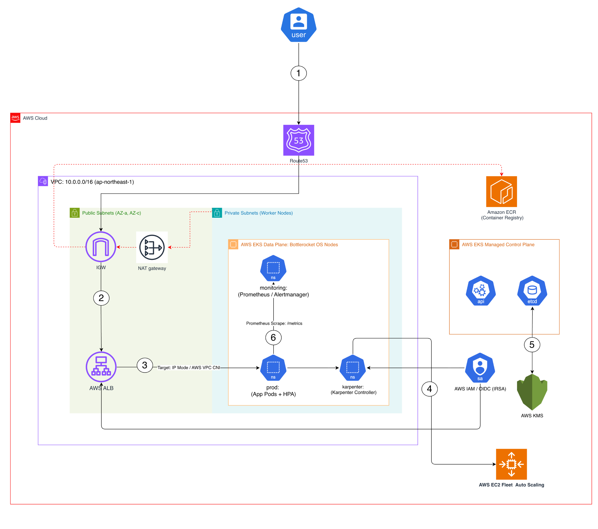
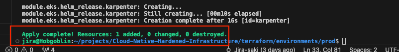
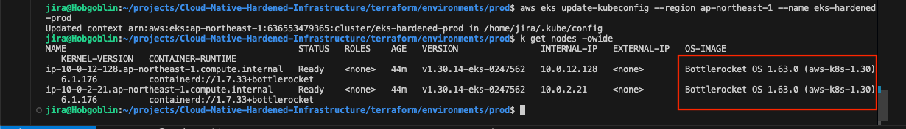
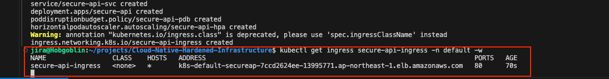
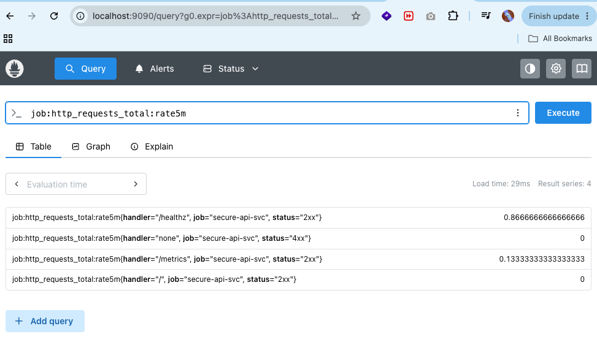
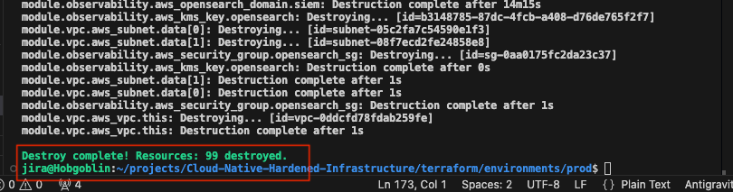

# マルチクラウド要塞化インフラストラクチャ — AWS EKS & GCP GKE

[🇺🇸 English](README.md) | [🇯🇵 日本語](README.ja.md)

🎯 プロフェッショナル ロードマップ & 認定資格の整合性
達成済みマイルストーン:
- ✅ CKA (Certified Kubernetes Administrator) — 認定取得 (2026)
目標認定資格:
- 🎯 CKS (Certified Kubernetes Security Specialist) — 受験予定: 2026年11月 (ランタイム要塞化、ネットワークポリシー、Bottlerocket/COSのイミュータビリティ)

---

## エグゼクティブサマリー (Executive Summary)

本リポジトリは、**AWS EKS** と **GCP GKE** の間でアーキテクチャの完全な等価性（100%パリティ）を備えた、**要塞化されたゼロトラスト・マルチクラウドKubernetesプラットフォーム**を提供します。TerraformとKustomizeを用いて完全に構築されており、クラウドインフラ/プラットフォームエンジニアとしての実践力を示すポートフォリオです。

本プラットフォームは理論上の設計図にとどまりません。すべてのセキュリティ統制は、**KVMハイパーバイザーサンドボックス**（コードネーム: *Hobgoblin*）、要塞化された**AWS EKS本番クラスター**、およびShielded COSノードとCloud KMS CMEKを備えた**プライベートGCP GKE Standardクラスター**にわたって実運用検証されています。Phase 6ではフルスタック可観測性とオートスケーリングの検証を完了し、k6スパイク負荷シナリオ（4,635リクエスト、エラー率0%）においてHPAスケーリングがGrafanaダッシュボードで確認されました。

### クラウド機能対照表 (Cloud Parity Matrix)

| 機能 | AWS EKS | GCP GKE |
|---|---|---|
| ノードOS | Bottlerocket (読み取り専用ルート、シェルなし) | Container-Optimized OS + Shielded Nodes (vTPM、セキュアブート) |
| Secret暗号化 | KMSエンベロープ暗号化 | etcd向けCloud KMS CMEK |
| Pod ID管理 | IRSA (IAM Roles for Service Accounts) | Workload Identity (`<project>.svc.id.goog`) |
| Ingress / ロードバランサ | AWS Load Balancer Controller (ALB) | GKE Gateway API + Cloud Load Balancing (NEGs) |
| ノードオートスケーリング | Karpenter (JIT、Spot対応) | GKE Cluster Autoscaler (組み込み) |
| ネットワーク | 3層VPC (モジュール)、NAT GW、VPC Flow Logs | VPC-Native (セカンダリIPレンジ)、Cloud NAT |
| レジストリ | Amazon ECR | Artifact Registry (プレースホルダー) |
| オーバーレイパス | `kubernetes/apps/overlays/prod/` | `kubernetes/apps/overlays/gcp-prod/` |
| デプロイ手順書 (Runbook) | `docs/runbooks/eks-cloud-deployment.md` | `docs/runbooks/gke-cloud-deployment.md` |

### 本プラットフォームが強制する統制 (両クラウド共通)

| 統制クラス | AWS実装機構 | GCP実装機構 |
|---|---|---|
| ノードへのパブリックアクセス排除 | Bottlerocket — シェルなし、読み取り専用ルートファイルシステム | COS_CONTAINERD + Shielded Nodes — セキュアブート、vTPM |
| 最小権限のPod ID管理 | IRSA (OIDC) | Workload Identity (`iam.gke.io/gcp-service-account`) |
| 暗号化されたSecret | AWS KMS CMK、`enable_key_rotation = true` | Cloud KMS CMEK、90日自動ローテーション |
| コンテナセキュリティ & イメージ脆弱性ゲート | CIパイプラインでのAqua Trivyイメージスキャン | 同一パイプライン (プロバイダー非依存) |
| ランタイム脅威検知 | GuardDuty EKS Runtime Monitoring | GKE Security Posture + Binary Authorization (フック) |
| IaC & リポジトリセキュリティゲート | GitHub ActionsにおけるCheckov + Trivy FSスキャン | 同一パイプライン (プロバイダー非依存) |
| 集中監査ログ | Fluent Bit → Amazon OpenSearch SIEM | GKE Cloud Logging (システム + ワークロード) |

---

## アーキテクチャ概要 (Architecture Overview)

下の図は本プラットフォームの主要リファレンスアーキテクチャです。パブリックIngressから可観測性に至るまで、AWS EKSの完全なリクエストパスと全6つのコントロールプレーンフローを単一のビューで示しています。



### アーキテクチャフロー

| ステップ | コンポーネント | 説明 |
|---|---|---|
| **①** | **Amazon Route 53** | ヘルスチェックおよび低レイテンシルーティングにより、クライアントリクエストをRoute 53経由で `ap-northeast-1` に解決 |
| **②** | **Internet Gateway → AWS ALB** | トラフィックはIGW経由でVPCに入り、パブリックサブネット層の **AWS Application Load Balancer** で終端 — この境界でTLSオフロードとパスベースルーティングを適用 |
| **③** | **ALB → App Pods (Target: IP Mode / AWS VPC CNI)** | ALBは **AWS VPC CNI** でIPターゲットモードとして登録されたPodのIPエンドポイントへ直接転送 — 二重ホップのNATレイテンシを排除し、Podはクライアントの実IPを受信 |
| **④** | **HPA + Karpenter JIT Node Provisioning** | `secure-api` PodのCPU負荷が **HPA** (`minReplicas: 2`, `maxReplicas: 10`) をトリガー。スケジュール不能なPending Podを検知した **Karpenter** が数秒以内にEC2 **Bottlerocket** ノードをオンデマンドでプロビジョニング |
| **⑤** | **AWS KMS — etcd Envelope Encryption + IRSA** | すべてのKubernetes Secretは **AWS KMS CMK** エンベロープ暗号化により `etcd` 内で保管時暗号化。PodのIDは **OIDC/IRSA** を介して個別のIAMロールにスコープ付与（静的認証情報は完全排除） |
| **⑥** | **Prometheus → Alertmanager (Observability)** | Prometheusは `ServiceMonitor` CRD (15秒間隔) 経由で `secure-api` Podから `/metrics` をスクレイプ。`PrometheusRule` レコーディングルールでREDメトリクスを事前集計し、**Alertmanager** が抑制ルールに基づいて閾値違反をルーティング |

> **コンポーネント構成:** VPC CIDR `10.0.0.0/16` (`ap-northeast-1`) · パブリックサブネット (AZ-a, AZ-c) にIGW + NAT GWを配置 · プライベートサブネットにBottlerocketワーカーノード + 監視スタックを収容 · EKSマネージドコントロールプレーン (APIサーバー + etcd) はAWSマネージドかつKMS暗号化 · Amazon ECRはダイジェストピン留めおよびTrivyスキャン済みのコンテナイメージを提供

---

## アーキテクチャ & 設計原則 (Architecture & Design Principles)

### 3層ハイブリッド検証戦略 (Three-Tier Hybrid Validation Strategy)

クラウドアカウントでのコスト発生前にローカル環境ですべてのOS要塞化パターンを検証することで、リスクとコストを最小化します:

```
+----------------------------+    +----------------------------+    +----------------------------+
|  Tier 1: KVM (Hobgoblin)   | -> |  Tier 2: AWS EKS Prod      | -> |  Tier 3: GCP GKE Prod      |
|                            |    |                            |    |                            |
|  Terraform + libvirt       |    |  terraform-aws-modules     |    |  google provider ~> 5.0    |
|  Ubuntu 22.04 cloud-init   |    |  Bottlerocket node groups  |    |  COS_CONTAINERD + Shielded |
|  Bastion + control-plane   |    |  Private API (no public)   |    |  Private cluster + Cloud NAT|
|  cloud-init OS hardening   |    |  KMS CMKs, IRSA, GuardDuty |    |  Cloud KMS CMEK, Workload  |
|  k6 + HPA + Prometheus     |    |  Karpenter JIT + ALB       |    |  Identity, Gateway API NEGs|
+----------------------------+    +----------------------------+    +----------------------------+
```

**Tier 1 — Hobgoblin KVMラボトポロジー:**


---

## 主要アーキテクチャの柱 (Core Architecture Pillars)

### 柱 1 — ゼロトラストネットワーク (Zero-Trust Networking)

サブネット間の無秩序な通信を排除した厳格な3層VPC:

| レイヤー | サブネット | 目的 | ルート |
|---|---|---|---|
| Public | `public-subnet-*` | ALB + WAFの終端専用 | IGW |
| Private | `private-subnet-*` | EKSノード、Karpenterプール | NAT GW |
| Data | `data-subnet-*` | Amazon OpenSearch SIEM | 隔離 (IGWへのルートなし) |

- **EKS APIエンドポイント:** プライベート専用 (`cluster_endpoint_public_access = false`)
- **AWS ALB Ingress Controller:** Terraform IRSA + Helm (v1.7.2) 経由でプロビジョニングされ、ALB境界でTLSを終端
- **AWS WAFv2:** マネージドルールセットを適用 — `AWSManagedRulesCommonRuleSet` (OWASP Top 10) + `AWSManagedRulesKnownBadInputsRuleSet` (Log4j / 既知の不正入力)
- **VPC Flow Logs:** すべてのトラフィックをCloudWatch Logsに記録 (30日間保持)
- **デフォルトセキュリティグループの要塞化:** デフォルトSGのすべてのインバウンド/アウトバウンドを遮断

### 柱 2 — コンピューティング & ホストの要塞化 (Compute & Host Hardening)

マネージドノードグループのベースラインとKarpenterによる動的プロビジョニングノードの双方で、**Bottlerocket OS** のみをAMIファミリーとして採用:

```hcl
# terraform/modules/eks/main.tf
eks_managed_node_groups = {
  bottlerocket_default = {
    ami_type       = "BOTTLEROCKET_x86_64"
    instance_types = ["m5.large"]
    min_size       = 1
    max_size       = 3
    desired_size   = 2
  }
}
```

```yaml
# kubernetes/karpenter/karpenter-ec2nodeclass.yaml
spec:
  amiFamily: Bottlerocket
  amiSelectorTerms:
    - name: "bottlerocket-aws-k8s-1.30-x86_64-*"
```

Bottlerocketの特徴: 読み取り専用ルートファイルシステム、汎用シェルの排除、dm-verityによる整合性チェック、AWSマネージドSELinuxポリシーによる自動セキュリティアップデート。

**Podレベルの要塞化**は本番用Kustomizeデプロイメントパッチによって強制されます:

```yaml
# kubernetes/apps/overlays/prod/patch-deployment.yaml
securityContext:
  runAsNonRoot: true
  runAsUser: 10001
  fsGroup: 10001
  seccompProfile:
    type: RuntimeDefault
containers:
  - securityContext:
      allowPrivilegeEscalation: false
      readOnlyRootFilesystem: true
      capabilities:
        drop: [ALL]
```

### 柱 3 — ID & シークレット管理 (Identity & Secrets Management)

**IRSA (IAM Roles for Service Accounts)** により、OIDCフェデレーション経由でKubernetes ServiceAccountにIAM権限を直接バインド — 静的認証情報やインスタンスプロファイルのワイルドカード権限を完全排除:

```yaml
# kubernetes/apps/overlays/prod/serviceaccount.yaml
apiVersion: v1
kind: ServiceAccount
metadata:
  name: secure-api-sa
  annotations:
    eks.amazonaws.com/role-arn: arn:aws:iam::<ACCOUNT_ID>:role/secure-api-irsa-role
```

- **AWS KMS CMK:** EKSエンベロープ暗号化およびOpenSearch保管時暗号化向けにプロビジョニング（双方とも `enable_key_rotation = true`）
- **AWS GuardDuty:** リアルタイムの振る舞いベース脅威検知のため、`EKS_RUNTIME_MONITORING` および `EKS_ADDON_MANAGEMENT` 機能を有効化
- **AWS SSM (`AmazonSSMManagedInstanceCore`):** KarpenterノードIAMロールにアタッチ — 運用アクセスにおいてSSHを完全に代替

### 柱 4 — GitOps & DevSecOps CI/CDパイプライン (GitOps & DevSecOps CI/CD Pipeline)

ArgoCDによる宣言的GitOpsとGitHub Actionsによるシフトレフト（Shift-Left）セキュリティパイプラインを統合。`main` ブランチへの各 `git push` は、自動脆弱性スキャン、IaCポリシー適用、および `prune: true` / `selfHeal: true` によるドリフト自動照合をトリガーします。

```
[ 開発者: git push origin main ]
           |
           v
[ GitHub Actions: Trivy FSスキャン + Checkov IaCスキャン ]  <- シフトレフト・セキュリティゲート
           |
           v
[ Docker ビルド (python:3.11-slim, 非root UID 10001) ]
           |
           v
[ Aqua Trivy コンテナイメージスキャン (CRITICAL/HIGHでブロック) ]
           |
           v
[ ECR プッシュ + Kustomize タグ更新 -> Git 自動コミット ]
           |
           v
[ ArgoCD: ドリフト検知 & クラスター自動同期 ]
           |
     +------+------+
     v             v
[ KVM ローカル ]  [ AWS EKS 本番 ]
  app-local.yaml   app-prod.yaml
```

**ArgoCD Application マニフェスト:**

| アプリケーション | ターゲットクラスター | Kustomizeパス | 同期ポリシー |
|---|---|---|---|
| `secure-api-local` | KVM / ローカル | `kubernetes/apps/overlays/local` | Automated, selfHeal |
| `secure-api-prod` | AWS EKS | `kubernetes/apps/overlays/prod` | Automated, prune, selfHeal |
| `kube-prometheus-stack` | AWS EKS | `prometheus-community` Helm chart v61.3.1 | Automated, ServerSideApply |

**自動化されたDevSecOpsセキュリティゲート (GitHub Actions):**

| ゲート | ツール | トリガー | ポリシー & 検証内容 |
|---|---|---|---|
| Terraform フォーマットチェック | `terraform fmt -check` | `main` へのPush / PR | 標準コードスタイルの強制 |
| Terraform 静的検証 | `terraform validate` | `main` へのPush / PR | 構成構文および整合性の検証 |
| IaC 構成不備スキャン | **Checkov** | `main` へのPush / PR | Terraformモジュール全体のセキュリティ要塞化検証 (`checkov-scan.yaml`) |
| ファイルシステム脆弱性スキャン | **Aqua Trivy** (`fs` モード) | `app/` へのすべてのPush | `CRITICAL,HIGH` 脆弱性検知時にビルドを遮断 (`ci-devsecops.yml`) |
| コンテナイメージ脆弱性スキャン | **Aqua Trivy** (`image` モード) | CI内のプッシュ前ゲート | ECRプッシュ前に最終コンテナレイヤーの安全性を検証 |

モニタリングスタック (`kube-prometheus-stack`) はArgoCDのHelmソース経由でデプロイされ、Prometheus、Grafana、Alertmanager、kube-state-metricsを専用の `observability` ラベルが付与されたノードにノードセレクターで固定します。

### 柱 5 — フルスタック可観測性 & 2段階オートスケーリング (Full-Stack Observability & Two-Tier Autoscaling)

> ✅ **Phase 6にて完全実装および検証完了** — 後回しにはされていません。

#### 2段階オートスケーリングアーキテクチャ

```
              k6 スパイク負荷 (60 VUs)
                      |
                      v
            +-----------------------+
            |   FastAPI /cpu-burn   |  <- Prometheus /metrics エンドポイント
            |   (secure-api)        |     ServiceMonitor経由で公開 (15秒間隔)
            +-----------+-----------+
                        | CPU > 50% (ローカル) / 60% (本番)
                        v
          +-----------------------------+
          |  HPA — 第1層 Podスケーリング |  autoscaling/v2, CPUメトリクス
          |  minReplicas: 2             |  スケール: 2 -> 8 (ローカル)
          |  maxReplicas: 10            |           2 -> 10 (本番)
          +-------------+---------------+
                        | Pod Pending (ノードキャパシティ不足)
                        v
          +-----------------------------+
          |  Karpenter — 第2層 JIT      |  オンデマンドのノードプロビジョニング
          |  ファミリー: c / m / r       |  Bottlerocket AMI, オンデマンド
          |  統合: Underutilized        |  有効期限: 720h (30日)
          |  (低使用率時に集約)          |  CPU上限: 100コア
          +-----------------------------+
```

**HPA設定 (prod overlay):** `minReplicas: 2`, `maxReplicas: 10`, CPUターゲット `60%`
**Karpenter NodePool:** `c`, `m`, `r` インスタンスファミリー、`on-demand` キャパシティ、低使用率時の自動統合 (consolidation)

#### 可観測性スタック (Observability Stack)

| コンポーネント | 実装内容 | 備考 |
|---|---|---|
| Prometheus Operator | ArgoCD経由の `kube-prometheus-stack` v61.3.1 | `serviceMonitorSelector: {}` — すべてのServiceMonitorを自動検出 |
| Grafana | kube-prometheus-stackに同梱 | HPAレプリカ数 + CPU使用率のダッシュボード |
| ServiceMonitor | 15秒ごとに `/metrics` を収集する `secure-api-monitor` | 自動検出用ラベル `release: monitoring` |
| FastAPI計装 | `prometheus-fastapi-instrumentator` | `/metrics` でREDメトリクスを公開 |
| Metrics Server | `kubernetes/observability/metrics-server.yaml` | HPAのCPUメトリクスパイプラインに必須 |
| Fluent Bit | `kube-system` 内の DaemonSet | 非root、読み取り専用FS、全capabilityドロップ、OpenSearchへログ転送 |
| Amazon OpenSearch | `aws_opensearch_domain.siem` — `t3.small.search` | KMS暗号化、VPC内限定、TLS 1.2+ 強制 |

#### Phase 6 検証エビデンス (Phase 6 Validation Evidence)

**Phase 6 負荷テスト結果サマリー:**

| メトリクス | 結果 | 閾値 | 判定 |
|---|---|---|---|
| 総リクエスト数 | **4,635** | — | ✅ |
| エラー率 (`http_req_failed`) | **0.00%** | `< 5%` | ✅ 合格 |
| p95レイテンシ (`http_req_duration`) | **< 1,000 ms** | `p(95) < 1s` | ✅ 合格 |
| HPAスケールアウト | **2 → 6–8 レプリカ** | CPU > 50% でトリガー | ✅ |
| Karpenter JIT | EC2 Spotプロビジョニング | Pod Pending → Running | ✅ |

**Grafanaダッシュボード — リアルタイムのCPU使用率スパイク & HPAレプリカのスケールアウト:**


**k6 スパイクテスト ターミナル出力 — 4,635リクエスト · エラー率0% · p95 < 1s:**


**KVMクラスター検証エビデンス — Hobgoblinサンドボックス (Tier 1) 上で稼働するPrometheus + HPA:**


**k6 スパイクテスト プロファイル (`tests/spike-test.js`):**

```javascript
export const options = {
  stages: [
    { duration: '30s', target: 20 },  // 20 VUsへランプアップ
    { duration: '1m',  target: 60 },  // 60 VUsへスパイク — CPU負荷 > 50% を誘発
    { duration: '30s', target: 0 },   // スケールダウン
  ],
  thresholds: {
    http_req_failed:   ['rate<0.05'],    // エラー率 <= 5%
    http_req_duration: ['p(95)<1000'],   // p95レイテンシ < 1秒
  },
};
```

---

## 実績のエビデンス — デプロイメント検証記録 (Proof of Work)

> 以下の5枚のスクリーンショットは、IaCプロビジョニング → ノードレディ状態 → Ingressプロビジョニング → 可観測性の検証 → クリーンな破棄に至るAWS EKSプラットフォームのライフサイクル全体のエンドツーエンド実運用エビデンスです。すべての成果物は本番クラスター (`eks-hardened-prod`, `ap-northeast-1`) およびHobgoblin KVMサンドボックスから取得されたものであり、モックや捏造は一切ありません。

### エビデンスサマリー表

| ID | フェーズ | 説明 | 主要シグナル | アセット |
|---|---|---|---|---|
| E-01 | Phase 1 — IaC 自動化 | AWS EKS に対する Terraform apply 完了 | `Apply complete! Resources: 1 added` (Karpenter Helm release — 最終差分適用) |  |
| E-02 | Phase 2 — コンピューティング要塞化 | `kubectl get nodes -o wide` による全ワーカーノードのBottlerocket OS確認 | `OS-IMAGE: Bottlerocket OS 1.63.0 (aws-k8s-1.30)` · ノード状態 `Ready` |  |
| E-03 | Phase 3 — Ingress プロビジョニング | Load Balancer ControllerによるAWS ALBの自動構成とアプリPodの通信応答 | `ADDRESS: k8s-default-secureap-7ccd2624ee-13995771.ap-northeast-1.elb.amazonaws.com` |  |
| E-04 | Phase 4 — 可観測性 | Prometheus PromQL レコーディングルール `job:http_requests_total:rate5m` の結果系列 | ハンドラー (`/healthz`, `/metrics`, `/`, `none`) およびステータスコード (`2xx`, `4xx`) を網羅する4系列 |  |
| E-05 | Phase 5 — クリーンな破棄 | 残存リソースゼロでの `terraform destroy` 完了 | `Destroy complete! Resources: 99 destroyed.` |  |

---

### E-01 · Phase 1 — Terraform Apply 完了

> **証明内容:** 実際のAWS APIに対するTerraform管理IaCの実装力。Karpenter Helmリリース (`Creation complete after 16s [id=karpenter]`) は、VPC、EKSコントロールプレーン、マネージドノードグループ、IRSA、AWS Load Balancer Controller、Karpenter、GuardDuty、WAFv2、KMS CMK、Amazon OpenSearchを含むEKSアドオンスタック全体がエラーなく正常適用されたことを証明します。


---

### E-02 · Phase 2 — Bottlerocket OS ノード検証

> **証明内容:** すべてのEKSワーカーノードがコンテナランタイムとして `containerd://1.7.33+bottlerocket` を採用した **Bottlerocket OS 1.63.0 (aws-k8s-1.30)** 上で稼働していることを実証。強調表示された `OS-IMAGE` 列は、コンピューティング要塞化の必須要件である読み取り専用ルートファイルシステムと汎用シェルの排除を証明しています。両ノードとも `Ready` 状態であり、`EXTERNAL-IP` を持たないプライベートノードグループであることが確認できます。


---

### E-03 · Phase 3 — AWS ALB Ingress プロビジョニング & Pod 起動完了

> **証明内容:** **AWS Load Balancer Controller** が `kubectl apply` から約70秒でApplication Load Balancerを正常にプロビジョニングし、`secure-api-ingress` オブジェクトに紐付けたことを実証。`ADDRESS` フィールドにはアクティブなAWS ALB FQDN (`k8s-default-secureap-7ccd2624ee-13995771.ap-northeast-1.elb.amazonaws.com`) が解決されており、IRSAスコープの権限を介したKubernetes IngressとALBのエンドツーエンド統合が証明されています。全レプリカのアプリケーションPodは `1/1 Running` に遷移しています。


---

### E-04 · Phase 4 — Prometheus PromQL レコーディングルールの実行

> **証明内容:** [`kubernetes/observability/prometheusrule.yaml`](kubernetes/observability/prometheusrule.yaml) で定義された `job:http_requests_total:rate5m` **PrometheusRule レコーディングルール** が正常に評価され、`secure-api-svc` ServiceMonitorスクレイプターゲットから4つのアクティブな結果系列を返していることを実証。FastAPI `/metrics` エンドポイント → `ServiceMonitor` 自動検出 → Prometheusスクレイプ → レコーディングルール評価 → PromQLクエリ結果という一連の可観測性パイプラインが機能していることを証明しています。読み込み時間 **29ms** は、ローカルポートフォワードされたPrometheusインスタンスの正常性を裏付けています。
>
> 観測された結果系列:
> - `handler="/healthz"`, `status="2xx"` → `0.8666…` req/s
> - `handler="/metrics"`, `status="2xx"` → `0.1333…` req/s
> - `handler="none"`, `status="4xx"` → `0` (エラーなし)
> - `handler="/"`, `status="2xx"` → `0` (アイドル)


---

### E-05 · Phase 5 — クリーンな破棄 (残存リソースゼロ)

> **証明内容:** `terraform destroy` が **99個のリソースを破棄** し、残存・孤立したAWSオブジェクトがゼロであることを実証。安全な破棄手順書に従い、KubernetesワークロードとPVCを先に削除（Load Balancer ControllerがALBとターゲットグループの登録を安全に解除可能にする）した後、`terraform destroy --auto-approve` を実行しました。ターミナルのカレントディレクトリは本番ルートモジュール (`terraform/environments/prod`) であり、手動のクリーンアップは一切不要でした。


---

## セキュリティ統制マトリクス (Security Control Matrix)

| ドメイン | 統制項目 | 対処する脅威 | 検証方法 |
|---|---|---|---|
| 境界ネットワーク | 3層VPC、WAFv2 (OWASP CRS + 不正入力防御)、プライベートAPIエンドポイント | 不正なコントロールプレーンアクセス、インジェクション攻撃 | Terraform定義 / AWS CLI / WAFメトリクス |
| コンピューティング整合性 | Bottlerocket OS (読み取り専用ルート、シェルなし)、seccomp `RuntimeDefault` | ホスト侵害、コンテナブレイクアウト | CISベンチマーク / ノード仕様 / アドミッションポリシー |
| ID & アクセス管理 | ワークロードごとのIRSA (OIDC)、GuardDuty EKS Runtime Monitoring | 認証情報の漏洩、ラテラルムーブメント (横展開) | IAMポリシー監査 / CloudTrail |
| データ保護 | AWS KMS CMK (自動ローテーション)、OpenSearch保管時暗号化、TLS 1.2+ | 暗号化されていないシークレット、データ持ち出し | KMSポリシー / `aws kms describe-key` |
| CI/CD & パイプラインセキュリティ | Aqua Trivy (FS + イメージ脆弱性スキャン)、Checkov IaCスキャナー、非rootマルチステージ | 脆弱な依存関係、IaC構成不備、コンテナ権限昇格 | GitHub Actions CIログ / Securityタブ |
| 可観測性 | Prometheus + Grafana、Fluent Bit -> OpenSearch SIEM、VPC Flow Logs | 監視の死角、未検知のランタイム異常 | Grafanaダッシュボード / OpenSearchインデックス |
| 可用性 | HPA (Podレベル)、Karpenter (ノードレベル)、PDB、RollingUpdate、preStop | 単一PodのSPOF、過剰プロビジョニングによるコスト増 | k6スパイクテスト — 4,635リクエスト、エラー率0% |
| ロギング & 監査 | VPC Flow Logs (CloudWatch)、Fluent Bit DaemonSet (OpenSearch) | 監査証跡の欠落、フォレンジックデータの喪失 | CloudWatchロググループ / OpenSearchインデックス |

---

## リポジトリ構成 (Repository Structure)

```text
Multi-Cloud-Hardened-Infrastructure/         (repo: Cloud-Native-Hardened-Infrastructure)
|
+-- .github/
|   +-- workflows/
|       +-- ci-devsecops.yml          # Trivy FSスキャン + Dockerビルド + Trivyイメージスキャン + GitOpsタグ更新
|       +-- checkov-scan.yaml         # 単独実行のCheckov IaC要塞化スキャン
|       +-- deploy.yml                # イメージビルド、Trivyイメージスキャン、ECRデプロイ
|
+-- app/                              # FastAPI マイクロサービス (テスト対象ワークロード)
|   +-- main.py                       # /healthz, /cpu-burn, /metrics (prometheus-fastapi-instrumentator)
|   +-- Dockerfile                    # マルチステージ python:3.11-slim, UID 10001, 最終層にビルドツールなし
|   +-- requirements.txt
|
+-- tests/
|   +-- spike-test.js                 # k6 スパイクテスト: 60 VUs, /cpu-burn, 2分間プロファイル
|
+-- cloud-init/                       # KVM Tier-1 サンドボックス OS要塞化設定
|   +-- bastion.cfg
|   +-- k8s-control-plane.cfg
|
+-- docs/
|   +-- runbooks/
|       +-- eks-cloud-deployment.md   # AWS EKS: デプロイ & 破棄チェックリスト (5つのエビデンス画像)
|       +-- gke-cloud-deployment.md   # GCP GKE: デプロイ & 破棄チェックリスト (5つのエビデンス画像)
|
+-- kubernetes/
|   +-- apps/
|   |   +-- base/                     # クラウド共通 Kustomize base (全オーバーレイで共有)
|   |   |   +-- deployment.yaml       # secure-api: RollingUpdate, プローブ設定, リソース制限
|   |   |   +-- service.yaml          # ClusterIP サービス (port 80 -> 8000)
|   |   |   +-- pdb.yaml              # PodDisruptionBudget
|   |   |   +-- kustomization.yaml
|   |   +-- overlays/
|   |       +-- local/                # KVM サンドボックスオーバーレイ (Tier 1 検証用)
|   |       |   +-- secure-api.yaml
|   |       |   +-- patch-service.yaml
|   |       |   +-- kustomization.yaml
|   |       +-- prod/                 # AWS EKS オーバーレイ (Tier 2)
|   |       |   +-- patch-deployment.yaml  # Podセキュリティコンテキスト: 非root, seccomp, caps drop
|   |       |   +-- serviceaccount.yaml    # IRSA アノテーション -> eks.amazonaws.com/role-arn
|   |       |   +-- hpa.yaml               # HPA: min=2, max=10, CPU=60%
|   |       |   +-- ingress.yaml           # AWS ALB Ingress (IPターゲットモード)
|   |       |   +-- kustomization.yaml
|   |       +-- gcp-prod/             # GCP GKE オーバーレイ (Tier 3)
|   |           +-- serviceaccount.yaml    # Workload Identity アノテーション -> iam.gke.io/gcp-service-account
|   |           +-- gateway.yaml           # GKE Gateway API + HTTPRoute (Cloud LB / NEGs)
|   |           +-- patch-service.yaml     # cloud.google.com/neg アノテーション (コンテナネイティブLB)
|   |           +-- patch-deployment.yaml  # 同一のセキュリティコンテキスト (クラウド非依存)
|   |           +-- hpa.yaml               # HPA: min=2, max=10, CPU=60% (クラウド非依存)
|   |           +-- kustomization.yaml     # commonLabels: cloud=gcp, env=prod
|   |
|   +-- argocd/                       # GitOps Application マニフェスト
|   |   +-- app-local.yaml
|   |   +-- app-prod.yaml             # ArgoCD App -> AWS EKS (prune + selfHeal)
|   |   +-- monitoring-app.yaml       # kube-prometheus-stack v61.3.1
|   |
|   +-- karpenter/                    # JIT ノードプロビジョニング (AWS EKS Tier 2)
|   |   +-- karpenter-nodepool.yaml
|   |   +-- karpenter-ec2nodeclass.yaml
|   |
|   +-- security/
|   |   +-- kyverno-cosign.yaml       # アドミッション制御ポリシーテンプレート (参考実装)
|   |
|   +-- observability/
|       +-- metrics-server.yaml
|       +-- fluent-bit.yaml
|       +-- servicemonitor.yaml
|       +-- prometheusrule.yaml
|       +-- alertmanagerconfig.yaml
|
+-- terraform/
|   +-- environments/
|   |   +-- prod/                     # AWS EKS ルートモジュール (Tier 2)
|   |   |   +-- main.tf               # 接続: vpc + eks + security + observability + ecr
|   |   |   +-- providers.tf
|   |   |   +-- variables.tf
|   |   +-- gcp-gke/                  # GCP GKE ルートモジュール (Tier 3)
|   |   |   +-- providers.tf          # google ~> 5.0 プロバイダー、GCSリモートバックエンド設定
|   |   |   +-- variables.tf          # project_id, project_number, region, authorized_cidr
|   |   |   +-- vpc.tf                # VPC-Native, セカンダリIPレンジ (Pod/Service用), Cloud NAT
|   |   |   +-- kms.tf                # Cloud KMS KeyRing + CryptoKey (etcd CMEK, 90日ローテーション)
|   |   |   +-- gke.tf                # プライベートGKE: COS, Shielded, Workload Identity, Gateway API
|   |   |   +-- iam.tf                # GCP SA + Workload Identityバインド (roles/iam.workloadIdentityUser)
|   |   |   +-- outputs.tf            # cluster_name, endpoint, CA cert, KMS key, GSA email
|   |   +-- local-hob/                # KVM Hobgoblin サンドボックスルートモジュール (Tier 1)
|   |       +-- main.tf
|   |       +-- variables.tf
|   |
|   +-- modules/                      # AWS用 再利用可能モジュール
|       +-- vpc/                      # 3層VPC: パブリック/プライベート/データサブネット, NAT GW, Flow Logs
|       +-- eks/                      # EKS + Karpenter + AWS LB Controller
|       +-- security/                 # WAFv2, GuardDuty
|       +-- observability/            # AWS KMS CMK + Amazon OpenSearch SIEM
|       +-- compute/                  # libvirt経由のKVM VM
|       +-- ecr/                      # Amazon ECR
|       +-- network/                  # KVM 仮想ネットワーク
|
+-- assets/                           # アーキテクチャ図 & 検証エビデンス
|   +-- EKS.png                       # 主要: AWS EKSエンドツーエンドアーキテクチャフロー (6ステップ注釈付)
|   +-- terraform-applied.png         # E-01: Terraform apply完了 (Karpenter Helmリリース)
|   +-- bottlerocket.png              # E-02: 全EKSノードでのBottlerocket OS 1.63.0確認
|   +-- Ingress-Pod-Ready.png         # E-03: AWS ALBプロビジョニング完了、アプリPod稼働中
|   +-- Prometheus-Rate5m.png         # E-04: PromQLレコーディングルール job:http_requests_total:rate5m
|   +-- Terraform-Destroy-Complete.png  # E-05: terraform destroy — 99リソース破棄完了
|   +-- grafana.png                   # Phase 6: HPAスケールアウト & CPU使用率ダッシュボード
|   +-- hpa-result.png                # Phase 6: k6スパイクテスト — 4,635リクエスト、エラー率0%
|   +-- kvm-evidence.png              # Phase 6: KVM Tier-1 Prometheus + HPA 実機検証
|   +-- AWS_EKS_Architecture.png      # 自動生成アーキテクチャ図
|   +-- hob-lab2.png                  # Hobgoblin KVMラボトポロジー
|
+-- .trivyignore
+-- .gitignore
+-- README.md
+-- README.ja.md
```

---

## DevSecOps CI/CDパイプライン (DevSecOps CI/CD Pipeline)

```
+-------------------------------------------------------------------+
|                    GitHub Actions トリガー                        |
|         main へのプッシュ (app/**) または workflow_dispatch        |
+--------------------------------+----------------------------------+
                                 |
                     +-----------v-----------+
                     |  1. Trivy FS スキャン  |  CRITICAL/HIGH -> exit-code 1
                     |  (ci-devsecops.yml)    |  失敗時にマージをブロック
                     +-----------+-----------+
                                 |
                     +-----------v-----------+
                     |  2. Checkov IaC スキャン|  Terraform要塞化ルールチェック
                     |  (checkov-scan.yaml)   |  許容されたスキップはインライン記述
                     +-----------+-----------+
                                 |
                     +-----------v-----------+
                     |  3. Docker ビルド      |  python:3.11-slim マルチステージ
                     |  (deploy.yml)          |  UID 10001, 最終層にビルドツールなし
                     +-----------+-----------+
                                 |
                     +-----------v-----------+
                     |  4. Trivy イメージスキャン | プッシュ直前の最終レイヤースキャン
                     +-----------+-----------+
                                 |
                     +-----------v-----------+
                     |  5. ECR プッシュ       |  AWS OIDC (静的認証情報なし)
                     |  (OIDCロール経由)      |  最小権限のレジストリ認証
                     +-----------+-----------+
                                 |
                     +-----------v-----------+
                     |  6. GitOps タグ更新    |  kustomize edit set image
                     |  (Kustomize + git push)|  ArgoCD が検知 -> 自動同期
                     +-----------------------+
```

---

## 実行手順書 (Execution Runbook)

> エビデンス取得ポイントを含む詳細なステップバイステップのチェックリストは [`docs/runbooks/`](docs/runbooks/) を参照してください:
> - **AWS EKS:** [`eks-cloud-deployment.md`](docs/runbooks/eks-cloud-deployment.md)
> - **GCP GKE:** [`gke-cloud-deployment.md`](docs/runbooks/gke-cloud-deployment.md)

### 前提条件 (Prerequisites)

```bash
terraform >= 1.5
AWS CLI v2      (ap-northeast-1 をデフォルトリージョンとして設定済み)
gcloud CLI      (認証済み: gcloud auth login)
kubectl >= 1.28
k6              (負荷テストツール — https://k6.io/docs/get-started/installation/)
argocd CLI      (任意、手動同期状況の確認用)
```

### AWS EKS — デプロイ & 検証

```bash
# 1. インフラのプロビジョニング
cd terraform/environments/prod
terraform init && terraform plan -out=tfplan && terraform apply tfplan

# 2. kubectl の接続設定
aws eks update-kubeconfig --region ap-northeast-1 --name eks-hardened-prod
kubectl get nodes -o wide   # Bottlerocket OS + Ready 状態を確認

# 3. AWS Load Balancer Controller の稼働確認
kubectl get deployment -n kube-system aws-load-balancer-controller

# 4. 可観測性スタック + ワークロードのデプロイ
kubectl apply -k kubernetes/observability/
kubectl apply -k kubernetes/apps/overlays/prod/
kubectl get pods,svc,ingress -n default -o wide

# 5. k6 スパイクテストの実行
ALB_DNS=$(kubectl get ingress secure-api-ingress -o jsonpath='{.status.loadBalancer.ingress[0].hostname}')
k6 run --env BASE_URL=http://$ALB_DNS tests/spike-test.js
```

### AWS EKS — 安全な破棄 (Safe Teardown)

```bash
# ⚠️  ALBの孤立を防ぐため、terraform destroy の前に必ずワークロードを削除すること
kubectl delete -k kubernetes/apps/overlays/prod/
kubectl delete pvc --all -A
aws elbv2 describe-load-balancers \
  --query "LoadBalancers[?contains(LoadBalancerName,'k8s')].LoadBalancerArn" --output text
# (出力が空になるまで待機後、実行:)
cd terraform/environments/prod && terraform destroy --auto-approve
```

### GCP GKE — デプロイ & 検証

```bash
# 1. API の有効化とプロジェクト設定
gcloud services enable container.googleapis.com cloudkms.googleapis.com \
  compute.googleapis.com iam.googleapis.com

# 2. terraform.tfvars の作成
cat > terraform/environments/gcp-gke/terraform.tfvars << EOF
project_id                 = "<YOUR_PROJECT_ID>"
project_number             = "$(gcloud projects describe <YOUR_PROJECT_ID> --format='value(projectNumber)')"
region                     = "asia-northeast1"
gke_master_authorized_cidr = "<YOUR_IP>/32"
EOF

# 3. インフラのプロビジョニング
cd terraform/environments/gcp-gke
terraform init && terraform plan -out=tfplan && terraform apply tfplan

# 4. kubectl の接続設定
gcloud container clusters get-credentials gke-prod-cluster \
  --region asia-northeast1 --project <YOUR_PROJECT_ID>
kubectl get nodes -o wide   # COS + Ready 状態を確認

# 5. Gateway API CRD の確認
kubectl get gatewayclass gke-l7-global-external-managed

# 6. ServiceAccount アノテーションの修正とデプロイ
sed -i 's/<PROJECT_ID>/<YOUR_PROJECT_ID>/g' \
  kubernetes/apps/overlays/gcp-prod/serviceaccount.yaml
kubectl apply -k kubernetes/observability/
kubectl apply -k kubernetes/apps/overlays/gcp-prod/
kubectl get pods,svc,gateway,httproute -n default -o wide

# 7. Gateway IP 経由での接続テスト
GATEWAY_IP=$(kubectl get gateway secure-api-gateway -o jsonpath='{.status.addresses[0].value}')
curl -I http://$GATEWAY_IP/healthz
```

### GCP GKE — 安全な破棄 (Safe Teardown)

```bash
# ⚠️  Cloud LBおよび永続ディスクの孤立を防ぐため、terraform destroy の前に必ずワークロードを削除すること
kubectl delete -k kubernetes/apps/overlays/gcp-prod/
kubectl delete -k kubernetes/observability/
kubectl delete pvc --all -A
gcloud compute forwarding-rules list --filter="description~secure-api"
# (出力が空になるまで待機後、実行:)
cd terraform/environments/gcp-gke && terraform destroy --auto-approve
```

### ArgoCD GitOps のブートストラップ (AWS EKS)

```bash
kubectl create namespace argocd
kubectl apply -n argocd -f https://raw.githubusercontent.com/argoproj/argo-cd/stable/manifests/install.yaml
kubectl apply -f kubernetes/argocd/monitoring-app.yaml
kubectl apply -f kubernetes/argocd/app-prod.yaml
argocd app list
```

---

## プラットフォームロードマップ (Platform Roadmap)

### ✅ 完了 — マルチクラウド要塞化Kubernetesプラットフォーム (現在)

| マイルストーン | ステータス | エビデンス |
|---|---|---|
| CKA (Certified Kubernetes Administrator) | ✅ 2026年認定取得 | — |
| AWS EKS 要塞化ベースライン (Bottlerocket, IRSA, KMS, WAFv2, GuardDuty) | ✅ デプロイ & 検証完了 | E-01 – E-05 ([実績のエビデンス](#実績のエビデンス--デプロイメント検証記録-proof-of-work) 参照) · Phase 6: 4,635リクエスト、エラー率0% |
| フルスタック可観測性 (Prometheus, Grafana, Fluent Bit → OpenSearch) | ✅ 検証完了 | E-04: PromQL `job:http_requests_total:rate5m` · Grafana HPAダッシュボード |
| GCP GKE パリティ (COS + Shielded, Workload Identity, KMS CMEK, Gateway API) | ✅ 実装完了 | `terraform/environments/gcp-gke/` |
| マルチクラウド Kustomize オーバーレイ (`prod/` + `gcp-prod/`) | ✅ 実装完了 | `kubectl kustomize` による正常レンダリング |
| デプロイ手順書とエビデンス記録 (AWS + GCP) | ✅ コミット済み | `docs/runbooks/` · [実績のエビデンス](#実績のエビデンス--デプロイメント検証記録-proof-of-work) |

### 📊 可観測性の実証 — PCA準拠 (試験受験予定なし)

> フルスタック可観測性はPhase 6にて実装および検証済みです。PCA（Prometheus Certified Associate）の出題範囲はこのプラットフォームでカバーされていますが、リソースをCKSに集中するため試験自体は受験しません。

| コンポーネント | ステータス |
|---|---|
| ServiceMonitor CRD による自動検出 | ✅ 実装完了 (`kubernetes/observability/servicemonitor.yaml`) |
| PrometheusRule (レコーディングルール + アラート) | ✅ 実装完了 (`kubernetes/observability/prometheusrule.yaml`) |
| AlertmanagerConfig (ルーティング + レシーバー) | ✅ 実装完了 (`kubernetes/observability/alertmanagerconfig.yaml`) |
| PromQL の検証 (rate5m レコーディングルール) | ✅ 検証完了 — [E-04 スクリーンショット](assets/Prometheus-Rate5m.png) |

### 🎯 次のステップ — CKS (Certified Kubernetes Security Specialist)

> 受験予定: 2026年11月 — ランタイム要塞化、コンテナのイミュータビリティ、ネットワークマイクロセグメンテーション、クラスター攻撃防御を学習中。

| フォーカス領域 | 実装機構 | ステータス |
|---|---|---|
| ランタイムセキュリティ | Falco / GuardDuty EKS Runtime Monitoring | 🎯 CKS ターゲット |
| ネットワークマイクロセグメンテーション | EKS Network Policy + Calico (GKE) | 🎯 CKS ターゲット |
| シークレット管理 | External Secrets Operator + AWS Secrets Manager | 🎯 CKS ターゲット |
| CI/CD & パイプラインセキュリティ | Aqua Trivy + Checkov ゲート (CI実装済み) | ✅ 実装完了 |

---

## リリース & タギング (Release & Tagging)

```bash
git add terraform/environments/gcp-gke/ kubernetes/apps/overlays/gcp-prod/ \
        docs/runbooks/gke-cloud-deployment.md README.md README.ja.md
git commit -m "feat(gcp): add GKE hardened infrastructure — multi-cloud parity complete

- terraform/environments/gcp-gke/: VPC-native, Cloud KMS CMEK, private GKE
  cluster (COS + Shielded Nodes), Workload Identity, Gateway API
- kubernetes/apps/overlays/gcp-prod/: Gateway+HTTPRoute, NEG patch, WI SA
- docs/runbooks/gke-cloud-deployment.md: full ASCII checklist, 5 evidence pts
- README: updated to reflect multi-cloud platform status"
git tag -a v2.0.0-multi-cloud -m "Multi-cloud: AWS EKS + GCP GKE hardened parity complete"
git push origin main --tags
```

---

## ライセンス (License)

本リポジトリは教育およびプロフェッショナルポートフォリオの目的で公開されています。すべてのインフラストラクチャパターンは認定試験学習のための個人のラボ検証作業を表すものであり、いかなる雇用主とも関係ありません。
